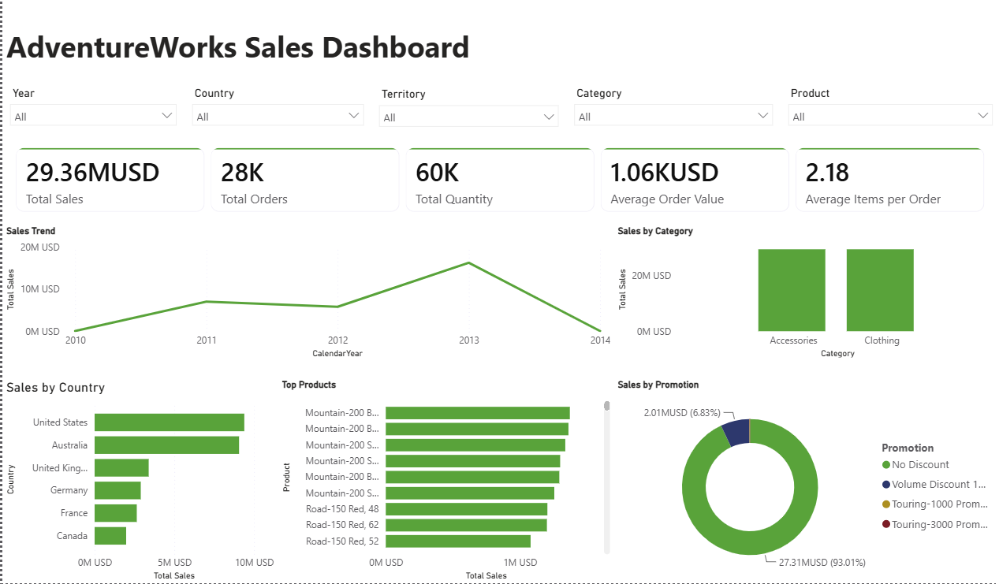
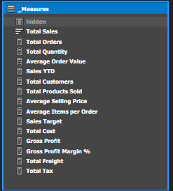
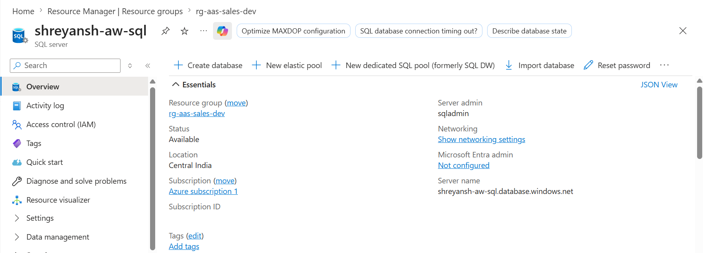
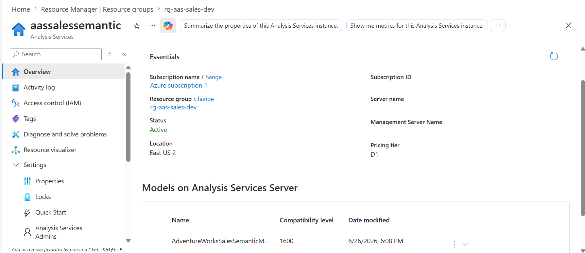

# Azure Analysis Services Semantic Model with Power BI Live Dashboard

An end-to-end Business Intelligence solution built using **Azure SQL Database**, **Azure Analysis Services (AAS)**, and **Power BI**. This project demonstrates enterprise semantic modeling, DAX measure development, KPI creation, and interactive dashboard reporting using a **Live Connection** to Azure Analysis Services.

---

## Project Overview

This project uses the **AdventureWorksDW2022** sample data warehouse to design and deploy a production-style semantic model in Azure Analysis Services. The model includes optimized relationships, reusable DAX measures, KPIs, display folders, and business hierarchies.

Power BI connects directly to the deployed semantic model using a **Live Connection**, enabling centralized business logic and consistent reporting.

---

## Architecture

```
AdventureWorksDW2022
        │
        ▼
Azure SQL Database
        │
        ▼
Azure Analysis Services
        │
        ▼
Semantic Model
 ├── Relationships
 ├── Measures
 ├── KPIs
 ├── Hierarchies
 ├── Perspectives
 └── Display Folders
        │
        ▼
Power BI (Live Connection)
        │
        ▼
Executive Sales Dashboard
```

---

## Technology Stack

- Azure SQL Database
- Azure Analysis Services (Tabular Model)
- Power BI Desktop
- SQL Server 2022
- Visual Studio 2022
- SQL Server Management Studio (SSMS)
- DAX

---

## Key Features

- Enterprise semantic model design
- Star schema implementation
- Optimized table relationships
- Centralized business logic using DAX
- KPI implementation
- Display folders for organized measures
- Business hierarchies
- Azure SQL Database integration
- Azure Analysis Services deployment
- Live Power BI connectivity
- Interactive executive dashboard

---

## Semantic Model Highlights

The semantic model contains:

- Fact and Dimension tables
- Optimized relationships
- Reusable DAX measures
- KPI definitions
- Business hierarchies
- Display folders
- Azure-hosted deployment

Example business measures include:

- Total Sales
- Total Orders
- Total Quantity
- Average Order Value
- Average Items per Order
- Gross Profit
- Gross Profit Margin %
- Total Customers
- Total Products Sold
- Average Selling Price
- Sales Target
- Total Freight
- Total Tax

---

## Dashboard Features

The Power BI dashboard provides:

- Executive KPI summary
- Sales trend analysis
- Sales by product category
- Sales by country
- Top-selling products
- Promotion performance analysis
- Interactive slicers for:
  - Year
  - Country
  - Territory
  - Category
  - Product

---

# Project Screenshots

## Executive Dashboard



---

## Measures



---

## Azure SQL Database



---

## Azure Analysis Services



---

## Skills Demonstrated

- Azure Cloud Services
- Azure SQL Database
- Azure Analysis Services
- Semantic Modeling
- Star Schema Design
- Data Modeling
- DAX
- KPI Development
- Business Intelligence
- Power BI
- Live Connection Reporting
- Enterprise Analytics

---

## Learning Outcomes

Through this project I learned:

- Designing enterprise semantic models
- Creating reusable DAX measures
- Building KPIs in Azure Analysis Services
- Deploying semantic models to Azure
- Connecting Power BI using Live Connection
- Managing Azure SQL authentication and networking
- Troubleshooting cloud deployment issues
- Building executive-level BI dashboards

---

## Repository Structure

```
azure-analysis-services-semantic-sales-model/

│── AdventureWorksSemanticModel/
│── PowerBI/
│── Screenshots/
│    ├── SalesDashboard.png
│    ├── MeasureTable.png
│    ├── AzureSQL.png
│    └── AzureAnalysisServices.png
│
└── README.md
```

---

## Future Improvements

- Role-Level Security (RLS)
- Incremental Processing
- Azure DevOps CI/CD deployment
- Performance optimization using partitions
- Additional business KPIs
- Multi-page executive reporting

---

## Author

**Shreyansh Kumar**

GitHub: https://github.com/shreyansh30

---
